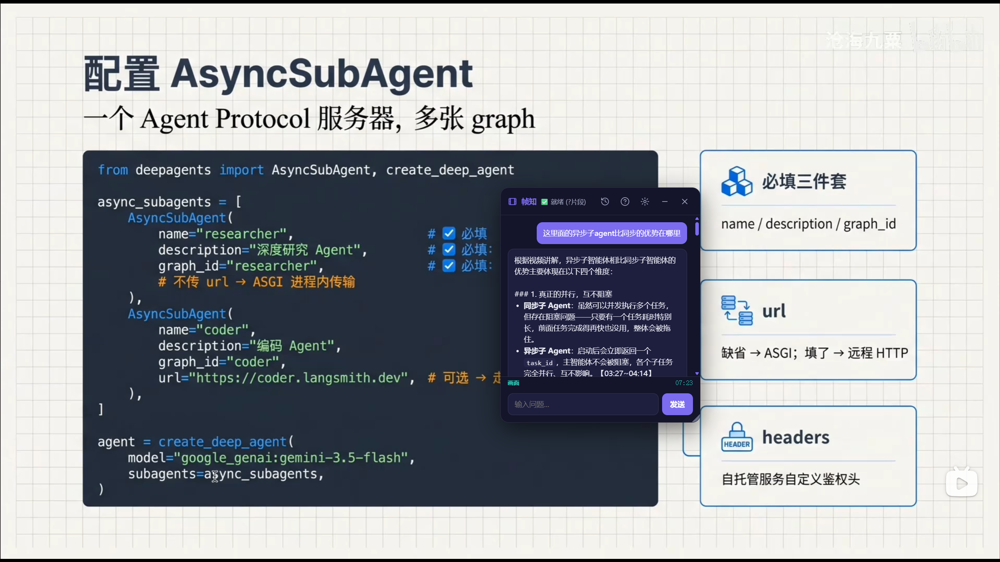

# 帧知 (FrameWise) 🎬

基于多模态 RAG 的视频学习 Agent。上传视频或粘贴B站/YouTube链接，AI 自动建立知识索引，支持文本问答、画面分析、主动出题。

## ✨ 特性

- 📝 **内容问答** — 带时间戳引用，点击跳转视频
- 🖼️ **画面分析** — 暂停时自动截图 + 视觉理解
- ❓ **主动学习** — AI 出题考察理解程度
- 🧩 **Chrome 插件** — B站/YouTube 原生集成，全屏可用
- 💾 **多轮对话** — 上下文记忆，跨会话持久化
- 📊 **用量追踪** — Token 消耗 + 费用统计
- 🐳 **Docker 部署** — 一行命令启动

## 🚀 快速开始

### 前置要求

- Python 3.12+
- ffmpeg（Windows 需[下载](https://ffmpeg.org/download.html)，Linux `apt install ffmpeg`）

### Docker（推荐）

```bash
git clone https://github.com/EgoistaCercis/framewise.git
cd framewise
cp .env.example .env        # 编辑 .env 填入 API Key
docker-compose up -d
```


### 手动安装

```bash
git clone https://github.com/EgoistaCercis/framewise.git
cd framewise
pip install -r requirements.txt
cp .env.example .env        # 编辑 .env 填入 API Key
python -m uvicorn backend.main:app --host 0.0.0.0 --port 8123
```

### 处理本地视频

浏览器打开 `http://localhost:8123`，可处理本地视频

### Chrome 插件

**方式一：源码安装（开发者）**

1. 打开 `chrome://extensions/`，开启右上角**开发者模式**
2. 点击**加载已解压的扩展程序**，选择项目的 `extension/` 目录
3. 打开 B站/YouTube 视频，右侧出现 🎬 悬浮按钮即可使用

**方式二：Zip 安装（普通用户）**

1. 从 [GitHub Releases](https://github.com/EgoistaCercis/framewise/releases) 下载 `framewise-extension.zip`
2. 解压到任意文件夹
3. `chrome://extensions/` → 加载已解压的扩展程序 → 选择解压后的文件夹

### 配置 API Key

编辑 `.env` 文件，至少填入以下 Key：

| 服务 | 获取地址 |
|------|---------|
| `LLM_API_KEY` | [DeepSeek](https://platform.deepseek.com/) |
| `EMBEDDING_API_KEY` | [硅基流动](https://siliconflow.cn/) |
| `VISION_API_KEY` | [阿里云 DashScope](https://dashscope.aliyun.com/) |

详见 `.env.example` 中的完整注释。

## 使用样例



## 🏗️ 架构

```
用户 → Chrome 插件 / Web 前端
         ↓ FastAPI 网关层（backend.main：CORS + Loguru + 视频状态管理）
         ↓
 ┌───────┼──────────┬──────────────┐
 ↓       ↓          ↓
视频摄取   ASR      RAG 检索
(url_*) (asr_*)  (vector_store / embedding)
 └───────┴──────────┴───────┬─────┘
                            ↓
       模型网关 gateway.py（统一 OpenAI 协议）
        chat / embed / vision / asr（含重试 + default/smart 路由）
                            ↓
     多模态 LLM（DeepSeek / Qwen VL / BGE-M3 / SenseVoice）
                            ↑
         pricing_service 定价 · cost_service 用量统计
```

## 📁 项目结构

```
framewise/
├── backend/                    # FastAPI 后端
│   ├── main.py                 # API 路由 + 应用入口
│   ├── config.py               # 配置管理（.env 驱动）
│   ├── prompts.py              # 统一提示词管理（预留 memory/skill 注入）
│   └── services/
│       ├── llm/                # 模型网关 / 厂商 / 定价 / 用量
│       │   ├── gateway         # OpenAI 统一网关（chat/embed/vision/asr，重试 + smart 路由）
│       │   ├── provider_service# 厂商标配查询
│       │   ├── pricing_service # 模型定价（带版本历史）
│       │   └── cost_service    # token 用量与费用统计
│       ├── media/              # 多媒体摄取与理解
│       │   ├── url_service     # 视频/字幕获取
│       │   ├── asr_service     # 语音识别（本地 whisper）
│       │   ├── asr_api_service # 语音识别（API）
│       │   ├── vision_service  # 画面分析
│       │   └── cache_service   # 文件缓存
│       ├── rag_pipeline/       # RAG 学习问答链路
│       │   ├── rag_service     # RAG 问答
│       │   ├── conversation_service # 多轮对话 + 上下文压缩
│       │   ├── embedding_service    # 向量化
│       │   ├── vector_store    # FAISS 检索
│       │   └── chunk_service   # 字幕切分
│       └── memory/             # 长期记忆（为 memory 系统预留）
│           └── memory_service
├── extension/                  # Chrome 插件
│   ├── content.js              # B站/YouTube 注入
│   └── manifest.json
├── frontend/                   # Web 前端
│   └── static/
├── scripts/  evaluation/  docs/  data/
├── Dockerfile
├── docker-compose.yml
├── requirements.txt
└── .env.example
```

## 📄 协议

[Apache License 2.0](LICENSE)

## ✉️ 联系方式

Egoista_G
